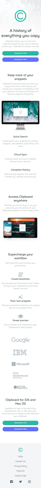

# Frontend Mentor - Clipboard landing page solution

This is a solution to the [Clipboard landing page challenge on Frontend Mentor](https://www.frontendmentor.io/challenges/clipboard-landing-page-5cc9bccd6c4c91111378ecb9). Frontend Mentor challenges help you improve your coding skills by building realistic projects.

## Table of contents

- [Overview](#overview)
  - [The challenge](#the-challenge)
  - [Links](#links)
  - [Screenshot](#screenshot)
    - [Mobile design](#mobile-design)
    - [Desktop design](#desktop-design)
- [My process](#my-process)
  - [Built with](#built-with)
  - [What I learned](#what-i-learned)
  - [Useful resources](#useful-resources)
- [Author](#author)

## Overview

### The challenge

Users should be able to:

- View the optimal layout for the site depending on their device's screen size
- See hover states for all interactive elements on the page

### Links

- Solution URL: [Frontend Mentor](https://www.frontendmentor.io/solutions/clipboard-landing-page-with-html5-and-sassscss-6iwYDasadc)
- Live Site URL: [GitHub Page](https://ax-cd.github.io/clipboard-landing-page-challenge/)

### Screenshot

#### Mobile design

#### Desktop design

## My process

### Built with

- HTML5
- SASS/SCSS
- Flexbox
- CSS Grid
- Mobile-first workflow

### What I learned

I learned about the property grid-auto-flow, which was useful for styling the links in the footer. And I also found a useful tool to get the filter color in order to change a SVG image color on hover.

### Useful resources

- ["grid-auto-flow : CSS Grid :: flex-direction : Flexbox" by Robin Rendle, CSS-TRICKS](https://css-tricks.com/grid-auto-flow-css-grid-flex-direction-flexbox/) - This article explains how the property grid-auto-flow works; it is the GRID equivalent of flex-direction for FLEXBOX.
- ["CSS filter generator" by Barrett Sonntag](https://codepen.io/sosuke/pen/Pjoqqp) - Useful to obtain the filter for a hex color in order to change the color of an SVG image.

## Author

- GitHub - [Ax-cd](https://github.com/Ax-cd)
- Frontend Mentor - [@Ax-cd](https://www.frontendmentor.io/profile/Ax-cd)
- Instagram - [@ax.coding](https://www.instagram.com/ax.coding/)
